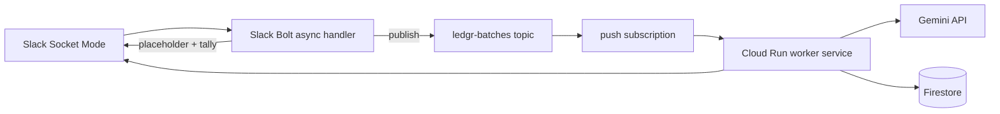

> **Archived 2026-07-01** — Describes the removed `accounting_agents` / `invoice_processing` graph and factory. **Live runtime:** `ledgr_slack` + `ledgr_agent` ([ADR-0032](../0032-ledgr-agent-and-slack-two-packages.md)). History only; do not implement against this doc.

# 0012 — Batch job queue via Cloud Pub/Sub (proposed)

- **Status:** Proposed — **not implemented**
- **Date:** 2026-06-16
- **Deciders:** Ledgr team

## Amendment — Realized in-process concurrency design (2026-06-18)

The Phase 1 (in-process) concurrency architecture is now fully specified and
partially implemented. This note records it as the authoritative description of
what is built at HEAD, distinct from the Phase 2 Pub/Sub proposal below.

**Fan-out:** the sequential `for f in files: await process_file_event(...)` loop
(`accounting_agents/slack_runner.py:6041-6106`) is replaced with
`asyncio.gather(*[_run_one(f) for f in files])` where `_run_one` is an inner
async function wrapping the per-doc processing. No additional semaphore is
introduced: `process_file_event` already acquires `_SEM =
asyncio.Semaphore(LEDGR_MAX_CONCURRENCY, default 5)` internally, so `gather`
self-bounds to the configured concurrency limit.

**Batch-reduce (fan-in):** `_flush_deferred_ledger_writes`
(`accounting_agents/slack_runner.py:1252`) runs once after all gathered results
are collected. It groups deferred payloads by `(client_id, fy, software, kind)`
and writes once per group — one consolidated ledger write per batch, not one
per document. Shared state (`batch_deferred`, `batch_file_ids`, hint fields) is
mutated only in the post-gather reduce, not inside the concurrent `_run_one`
bodies, to eliminate race conditions.

**Serialized per-(channel, FY) lock:** `SlackLedgerStore` holds a
`threading.Lock` keyed per `(channel_id, fy)` (`accounting_agents/ledger_store.py:237`)
that serializes all concurrent append operations for the same ledger target,
recomputes running balances, and enforces date-sorted bank statement merges.

**Required deterministic invoice sort:** the invoice `_append_rows_to_sheet`
path (`accounting_agents/ledger_store.py:483`) previously appended in arrival
order with no sort (unlike the bank branch, which already sorts). Under
`asyncio.gather`, arrival order is nondeterministic, so invoice row order would
vary run-to-run. A deterministic sort by `(date, invoice_number, doc_key)` on
the invoice append path is a **required** part of the fan-out change — not
optional.

**Pre-gather de-dup:** file IDs are de-duplicated before fan-out. The
`_seen.seen_before("file:{id}")` check lives in the loop body; under `gather`
two entries sharing an ID could both pass before either marks seen. De-duping the
input list before `gather` closes this window.

**HITL second write:** a paused document is not in `batch_deferred`; on approval
`handle_approval_action` → `persist_and_deliver` calls `append_rows` through the
same `SlackLedgerStore` lock, serialized against any concurrent batch flush by
the per-`(channel, fy)` lock. No bypass of `append_rows` is permitted.

This in-process design handles the 6–50-document case on a single Cloud Run
instance (`min=1/max=1`). The Phase 2 Pub/Sub proposal below addresses the
50–1000-document, multi-instance case.

## Context

A 6-file Slack drop on 2026-06-16 produced six top-level `Processing [dev] 'file.pdf'`
accordions plus a separate job summary. Root cause: `file_shared` events fired in
parallel before the `message/file_share` batch coordinator could post its single
job summary, so each `process_file_event` stamped Gemini with `N` parallel calls
lacking `thread_ts` or `defer_slack_delivery`.

Phase 1 (2026-06-16) made the `message` handler the sole document owner and
suppressed the per-doc "Received" status in batch mode. This solved the UX
problem in-process for a single Cloud Run instance. Two operational limits
remain that this ADR proposes to address in a follow-up sprint:

1. **Cross-instance dedup is process-local.** `_SeenEvents` (FIFO of 512
   recent event ids) and `_file_futures` (per-file asyncio futures) are
   in-memory only. A second Cloud Run instance behind a Slack-bolt
   autoscaler would race the first and either re-process or skip files
   unpredictably.
2. **Concurrent batches share Gemini's per-project rate limit.** Two
   channels dropping 5 files each at the same moment doubles the in-flight
   Gemini calls, regardless of `LEDGR_MAX_CONCURRENCY=5` (which is per-process).

## Decision

Adopt a **Cloud Pub/Sub job queue** between the Slack Bolt handler and the
document workflow:

- Bolt handler publishes one message per drop with payload
  `{channel_id, file_ids[], batch_id, user_id}`. It posts the
  placeholder job summary and returns immediately.
- A Cloud Run worker service (a separate Cloud Run revision, not the
  Bolt app) consumes the topic. Per-channel concurrency=1 via a
  `batches/{batch_id}` Firestore document with a lease field.
- Progress (`done`, `posted`, `needs_review`, `rejected`, `duplicates`)
  lives in `batches/{batch_id}` and the worker `chat_update`s the
  placeholder with live counts.
- The worker is the only place that calls `process_file_event`.
- `LEDGR_MAX_CONCURRENCY` becomes a per-worker-thread local, not a
  process-wide semaphore. Cross-worker back-pressure is delivered
  by Pub/Sub flow-control (max outstanding messages = `LEDGR_BATCH_PULL_CONCURRENCY`).

## Why not just add a bigger semaphore or scale Cloud Run?

| Option | Why not |
|--------|---------|
| Bigger `LEDGR_MAX_CONCURRENCY` | Doesn't fix cross-instance dedup. Two Bolt pods still race on `file_shared` and `message`. |
| Single-instance pinning via Firestore lease | Adds ad-hoc state to the Bolt handler; doesn't help the API rate-limit problem. |
| Cloud Tasks instead of Pub/Sub | Cloud Tasks is per-task scheduling; Pub/Sub is a fan-out queue. We need fan-out for a single batch processed serially per channel, with progress live-edits. Cloud Tasks would force per-file publishing, which is what we are explicitly avoiding. |

## Concrete plan (not this sprint)

1. **Topics / IAM** — `gcloud pubsub topics create ledgr-batches`,
   `ledgr-batch-events` (progress), `ledgr-batch-dlq` (failures). Service
   account: `ledgr-bolt@<project>.iam` publishes; `ledgr-worker@<project>.iam`
   subscribes. Existing Gemini API service account unchanged.
2. **Bolt handler** — replace the `for f in files: await process_file_event`
   loop with a single publish. Drop the `_file_shared` document processing
   block (already done in Phase 1A). Keep the `chat_postMessage` placeholder
   + `chat_update` tally flow.
3. **Worker service** — new Cloud Run service (`ledgr-worker`) subscribing
   to `ledgr-batches`. Reuses `accounting_agents` (the same Python
   package); only the entrypoint differs (`main_async()` now consumes
   Pub/Sub instead of socket mode). `process_file_event` is called
   sequentially per batch_id; `batch_mode=True` is always passed.
4. **Firestore lease** — `batches/{batch_id}.doc` carries
   `{channel_id, file_ids[], status, lease_worker, lease_expires_at,
   counters: {posted, needs_review, rejected, duplicates}}`. Workers
   `runTransaction` to claim the lease (TTL ~5min, refreshed every
   doc processed). Stale leases are auto-released and re-published.
5. **Failure handling** — NACK + `ledgr-batch-dlq` on transient
   errors; structured `failed_at: <node_name>` for the dead-letter
   inspection page (Cloud Console → Pub/Sub → DLQ).
6. **Capacity** — `LEDGR_BATCH_PULL_CONCURRENCY` env on the worker
   (default 4). Cloud Run min-instances=1 keeps the first drop warm.
   `LEDGR_BATCH_PULL_MAX_MESSAGES=10` to bound a single pull.

## Trade-offs

- **Latency:** adds ~200ms Pub/Sub publish + worker cold start (if
  scaled to zero). Acceptable for a batch drop but noticeable for
  single-doc drops. Mitigation: min-instances=1, ack-deadline=60s.
- **Debugging:** the Slack ↔ Firestore correlation story changes
  (now: Bolt event_id ↔ batch_id ↔ worker logs). The placeholder
  job summary message carries the `batch_id` in its text for
  end-to-end traceability.
- **Cost:** Pub/Sub is essentially free at this scale
  (~$0.06/million messages). The worker Cloud Run is the
  material cost — a single min-instance runs ~$5/month plus
  Gemini API time, same as the Bolt app today.

## Implementation order (when this ADR is approved)

1. Topic + IAM bootstrapping
2. Bolt handler publishes; worker is a stub
3. Worker entrypoint + per-channel lease
4. Wire `process_file_event` to lease-held loop
5. Failure handling + DLQ
6. Roll back in-process semaphore (`LEDGR_MAX_CONCURRENCY`) to a worker-local default
7. Update `docs/block-kit-ui.md` and `docs/qa/2026-06-16-slack-delivery-batch-qa.md`
8. Live QA on `#acme-client-test` (mixed-FY batch, 5+ files)

## Why not now

Phase 1 (file_shared race fix + batch silent mode + aggregate delivery)
already delivers the user-visible UX improvements at zero infrastructure
cost. The Pub/Sub worker is a real architectural change that needs its
own sprint. Live eval/debug scripts (`scripts/debug_classify_direction.py`)
and the new summary-table HITL visibility close the sales/purchase debug
loop today, independent of the queue.

## Phase 2 — Patterns from Google's `race-condition` reference architecture

The [GoogleCloudPlatform/race-condition](https://github.com/GoogleCloudPlatform/race-condition)
project (Google Cloud Next '26 keynote open-source release) is a
multi-agent marathon simulation (Planner → Simulator → Runners) built with
**ADK + Gemini + A2A**. It is not a document-ingestion product, but several
of its design patterns translate directly to Ledgr's Phase 2 scale path.

| race-condition pattern | What it solves | Ledgr Phase 2 equivalent |
|------------------------|----------------|--------------------------|
| **Hub / Gateway** (Go) | Single entry point; clients never talk to agents directly. | Slack Bolt handler publishes one batch message and returns — no in-process `for f in files: await process_file_event` loop. |
| **Hub session pattern** | Gateway owns session IDs; routes with **batching** so hundreds of runners don't thundering-herd on each tick. | Bolt owns `batch_id`; one placeholder message per batch, not N per-doc accordions. The `batch_processing_plan_blocks` plan block from Slice 2 is the visible UX of this. |
| **Redis orchestration channel** | Fan-out lifecycle events; only wake agent types with **active sessions**. | Firestore `batches/{batch_id}` carries the lease. The worker pulls and processes only the batches it has claimed — no global scan. |
| **Dispatch modes** (`subscriber` vs `callable`) | Warm agents via Redis; cold-start via HTTP poke; dedup inside the agent. | Bolt publishes → worker pulls; idempotency on `file_id` lives in Firestore `processed_files/{file_id}`. At-least-once delivery from Pub/Sub is safe because of the idempotency key. |
| **Session registry** (Redis) | Cross-gateway routing without sticky sessions. | Firestore `batches/{batch_id}` is the cross-pod coordination point — the lease is the equivalent of a Redis session handle. |
| **Idempotency** | Session IDs + dedup in dispatcher. | `message_id` + `file_id` keys in Firestore. Pub/Sub at-least-once is the default; the dedup check is what makes it safe. |
| **Pub/Sub (telemetry path)** | Async debug/audit stream; doesn't block the agent thread. | Optional `ledgr-batch-events` topic for progress audit — workers can publish stage transitions for the QA dashboard without slowing the hot path. |
| **Autopilot variant** | Deterministic runner with zero LLM — baseline for load testing. | Hermetic `eval/fixtures/direction/` JSON fixtures (no PDFs, no API) used by the 30-case direction eval — same shape as `runner_autopilot` for infra validation. |

### Quote from the race-condition gateway design

> `PublishOrchestration` queries `ActiveAgentTypes()` and **only pokes agents
> that have ≥1 active session**. This prevents waking callable agents from
> scale-to-zero for nothing and O(all agents) HTTP requests when only
> O(active agents) needed.
>
> — [race-condition/docs/design/gateway-messaging.md](https://github.com/GoogleCloudPlatform/race-condition/blob/main/docs/design/gateway-messaging.md)

For Ledgr: **Bolt publishes one batch message and returns** — the worker
decides whether to start. With the `LEDGR_BATCH_PULL_CONCURRENCY=4`
flow-control on the worker, we never have O(all batches) threads running
when only O(active) batches actually exist.

### Phase 2 implementation order (this ADR's "concrete plan" refined)

1. **Topics + IAM** — `ledgr-batches`, `ledgr-batch-events`, `ledgr-batch-dlq`.
2. **Bolt handler** — replace the per-file loop with a single publish.
3. **Worker service** — new Cloud Run service (`ledgr-worker`) consuming
   `ledgr-batches`. Reuses `accounting_agents` package; only the entrypoint
   changes.
4. **Firestore lease** — `batches/{batch_id}` doc with `{lease_worker,
   lease_expires_at, counters}`. Workers claim via `runTransaction`.
5. **Idempotency** — `processed_files/{file_id}` dedup before any Gemini
   call, so Pub/Sub redelivery is safe.
6. **DLQ + structured failure** — `failed_at: <node_name>` in dead-letter
   for triage.
7. **Hermetic load test** — `runner_autopilot`-style zero-Gemini mode for
   1000-doc infra validation (mirrors the race-condition autopilot variant).

### Phased scale roadmap (less is more)

| Phase | Scope | Handles | Infra |
|-------|-------|---------|-------|
| **1 (this plan)** | In-process defer + batch plan + unified Understand | 6–50 docs, single instance | None |
| **2 (this ADR)** | Bolt publish → worker consume + Firestore lease | 50–1000 docs, multi-instance | Pub/Sub + `ledgr-worker` Cloud Run service |
| **3 (optional)** | Ordering key per channel + HPA on backlog | Sustained 1000+ concurrent | GKE or Cloud Run max-instances tuning |

**Phase 2 does NOT change extraction intelligence** — same
`process_file_event`, same Understand call, same HITL gate. Only **transport
and concurrency control** move to Pub/Sub. This matches Google's pattern:
separate **orchestration** from **intelligence**.

### What we explicitly do NOT copy from race-condition

- **Redis for job queue** — Ledgr already uses Firestore for state; Cloud
  Pub/Sub is the right buffer (this ADR).
- **A2A between classify/extract/tax** — ADR-0001 rejects per-step agent
  graph; the deterministic engine stays.
- **Tick-based broadcast** — Ledgr batches are finite jobs, not continuous
  simulation loops.
- **Multi-agent coordinator LLM** — Overkill; Pub/Sub + Firestore lease is
  sufficient orchestration.

### When Phase 2 becomes necessary

| Trigger | Why in-process breaks |
|---------|----------------------|
| **100+ docs in one drop** | Bolt handler timeout; Cloud Run request limit (60 min default, 5 min practical). |
| **Multi-instance Bolt** | `_SeenEvents` dedup is in-memory only — second pod races the first. |
| **Concurrent channel batches** | `LEDGR_MAX_CONCURRENCY=5` is per-process; Gemini project rate limit is shared. |
| **1000-doc month-end** | Need pull-based back-pressure, not a giant `for` loop. |

### Reference links

- [race-condition gateway design](https://github.com/GoogleCloudPlatform/race-condition/blob/main/docs/design/gateway-messaging.md)
- [race-condition dispatch modes](https://github.com/GoogleCloudPlatform/race-condition/tree/main/docs/design)
- [Google Cloud Pub/Sub best practices](https://cloud.google.com/pubsub/docs/publisher)
- [ADK PubSubToolset](https://adk.dev/integrations/pubsub/index.md) — useful
  for worker-side tooling, but the worker should use the native Pub/Sub
  client + existing `process_file_event`, not an LLM agent managing the queue.
