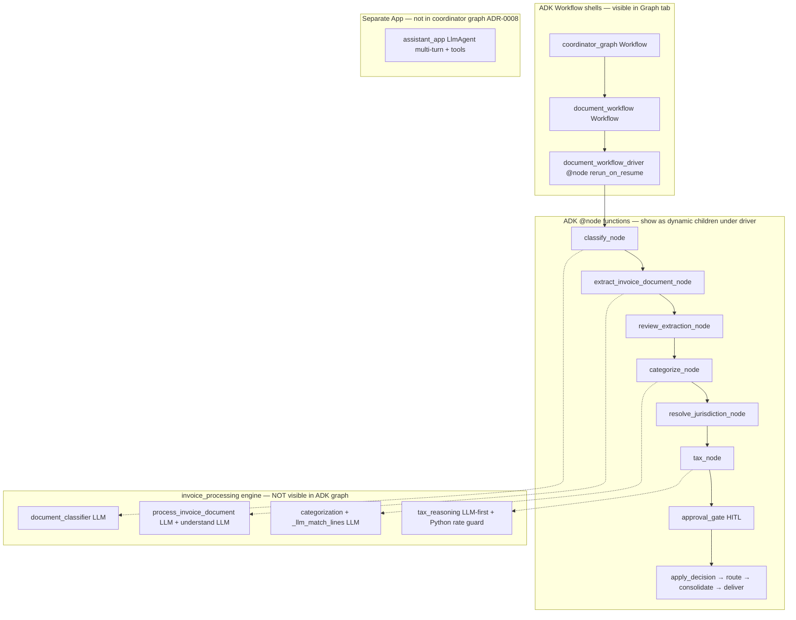

# ADK Architecture Map

Quick-reference for engineers + QA: what each layer in the Ledgr ADK build
does, what it does NOT do, and which ADK web tab reveals it.

The build uses all three of ADK's building blocks. Understanding which is
which — and which layer the smart logic actually lives in — is what separates
"the agent is hardcoded" from "the agent is mis-tuned." Use this map to
diagnose which layer is misbehaving when a session goes wrong.

## Three layers, three responsibilities

| Layer | ADK type | File(s) | Smart? | Where it lives |
|---|---|---|---|---|
| Coordinator | `Workflow` + `LlmAgent` single_turn | `accounting_agents/agent.py` | LLM picks intent (document / question / unknown) | Graph tab — top node |
| Router | `@node` function `dynamic_router` | `accounting_agents/agent.py` | None — maps intent → route label | Graph tab |
| Document shell | nested `Workflow` `document_workflow` | `accounting_agents/agent.py` | None — one edge to driver | Graph tab — second graph |
| Spine driver | `@node(rerun_on_resume=True)` `document_workflow_driver` | `accounting_agents/agent.py` | None — iterates lane node list | Graph tab — fan-out from START |
| Classify | `@node` `classify_node` → engine | `accounting_agents/nodes.py` | LLM inside (`document_classifier`) | Trace span + Event |
| Extract | `@node` `extract_invoice_document_node` | `accounting_agents/nodes.py` | LLM inside (`process_invoice_document`) | Trace span |
| Review | `@node` async gen `review_extraction_node` | `accounting_agents/nodes.py` | LLM **only when signals fire** | Trace span + Event |
| Categorize | `@node` `categorize_node` | `accounting_agents/nodes.py` | LLM (when COA exists) + deterministic rules | Trace span |
| Resolve jurisdiction | `@node` `resolve_jurisdiction_node` | `accounting_agents/nodes.py` | None — pure function `resolve_jurisdiction(state)` | Trace span — writes `state["tax_jurisdiction"]` |
| Tax | `@node` `tax_node` → `tax_reasoning` | `accounting_agents/nodes.py` + `accounting_agents/tax_reasoning.py` | **LLM-first** (Phase 8) with Python rate guard | Trace span |
| Approval | async gen `approval_gate` (HITL) | `accounting_agents/nodes.py` | None — threshold check + `RequestInput` | Pause in Events |
| Chat | root `LlmAgent` (separate App) | `accounting_agents/assistant.py` | Full agent + small read-only tools | Separate App |

## What "smart" means

Per Phase 8 / multi-country support, "smart" follows one rule:

* **LLM decides:** jurisdiction, tax treatment label, account category,
  direction when ambiguous, multi-receipt split.
* **Python only:** add numbers, compare to tolerance, block bad writes,
  pause for human, export, resolve jurisdiction deterministically.

Three places the build used to be Python-rigid and is now LLM-first:

1. **Tax classification** (`accounting_agents/tax_reasoning.py`) — was a
   300-line `TaxClassifier` loaded from `sg_gst.yaml` only. Now an LLM agent
   receives the resolved jurisdiction + reference YAML rate band via state
   templating; Python only does the math guard (rate ± tolerance).
2. **Country / tax-system extraction** (`invoice_extractor.py` /
   `ledger_extract.py`) — was null for YAU LEE. Now extracts
   `supplier.country` / `customer.country` + `tax_system_hint` and threads
   them into `NormalizedInvoice.party.country` so the jurisdiction router
   can pick the right rule set.
3. **Jurisdiction routing** (`accounting_agents/jurisdiction.py`) — was a
   hard-coded "always SG" call inside `tax_node`. Now a pure function
   `resolve_jurisdiction(state)` that picks SG / MY / CROSS_BORDER / AMBIGUOUS
   based on `state["region"]` + `state["base_currency"]` + counterparty
   country, and writes `state["tax_jurisdiction"]` for ADK web visibility.

## ADK web tabs — what to look at

| ADK web tab | Shows | Use for |
|---|---|---|
| **Graph** | The static DAG: `coordinator_graph` then nested `document_workflow` with the dynamic driver fanning out | Sanity-check the lane registry; the star-pattern under the driver is normal for `ctx.run_node` and does NOT indicate parallel execution |
| **Traces** | Ground-truth execution order: coordinator → driver → classify → extract → review → categorize → jurisdiction → tax → approval | **Always trust Traces over Graph for "what ran in what order"** |
| **Events** | Per-node events including `Event.route`, `state_delta`, tool calls, `RequestInput` (HITL pauses) | Verify the canonical lane route label (`commercial_doc` vs `bank_statement`); confirm `state["tax_jurisdiction"]` was set |
| **State** | The session state at the time of each event — keys, values | Confirm `region`, `tax_jurisdiction`, `client_name`, `doc_type`, `direction`, `supplier_country` are all present after classify + extract + tax |
| **Artifacts** | PDF + extracted files | Verify `upload.pdf` (flat name in dev — was `inbox/upload.pdf` causing 404) |

## Three Apps

| App | Root | Use for |
|---|---|---|
| `app` (name: `accounting_agents`) | `coordinator_graph` | ADK web / `agents-cli eval` golden cases (full coordinator → document flow) |
| `document_app` (name: `accounting_agents_document`) | `document_workflow` only | Production Slack uploads — skips the coordinator LLM hop, matches the prod path exactly |
| `assistant_app` (name: `accounting_agents_assistant`) | `assistant_agent` (chat) | Multi-turn chat with per-thread session history. **Must stay separate** per ADR-0008 — ADK rejects `mode='chat'` agents reached from a preceding graph node |

## Why the Graph tab looks "broken" but isn't

Per ADK Dynamic Workflows docs:

* Nested `Workflow` (e.g. `document_workflow`) renders as a gray box, not
  expanded — this is by design (per the "Nested workflows" section of
  the ADK Graph Routes docs).
* The driver + `ctx.run_node` fans children off `START` — the visual star
  is the natural rendering of a dynamic driver, not parallel execution.
  The **Traces** tab proves sequential execution (classify → extract →
  tax in order).
* `[NO DEFAULT]` on the coordinator router means: if no `Event.route`
  matches, the lane is unreachable. With our three-route dictionary
  (`document` / `question` / `unknown`) there is no default edge — the
  unknown lane routes to `help_node` so a future misroute degrades
  gracefully rather than aborting.

## Lane registry

`accounting_agents/lane_config.py` is the single source of truth for
doc-type → lane mapping:

* `DOC_TYPE_TO_LANE` — one map for `classify_node` (Event route label) and
  `document_workflow_driver` (iterated node list). Adding a new doc type
  is **one entry**, not scattered `if/else` in two places.
* `ROUTE_COMMERCIAL_DOC` — the canonical lane label that replaced the
  legacy `invoice` string (which contradicted `doc_type: receipt` in
  traces — that was the Phase 2 trace-clarity gap).

## Per-region rule set

`invoice_processing/shared_libraries/{sg_gst,my_sst}.yaml`:

* Slim (rates + code_map + signal lexicons). No 300-line rule spaghetti.
* Loaded by the LLM tax reasoner as prompt context (rates + signals) and
  by Python as the rate-guard reference (rates + tolerance).
* New jurisdictions add a new YAML + a new `JurisdictionRule` entry in
  `accounting_agents/jurisdiction.py`. No Python rule engine to grow.

## Common confusion: where does X live?

| Question | Answer |
|---|---|
| Where does the "is this a receipt or invoice" decision happen? | `classify_node` → `document_classifier.classify_document` (LLM). Result in `state[DOC_TYPE_KEY]`. |
| Where does "is this purchase or sales" decide? | `extract_invoice_document_node` → `process_invoice_document` → understand-extract LLM emits `direction_for_client`. Result in `state[DIRECTION_KEY]`. |
| Where does "which tax code" decide? | `tax_node` → `tax_reasoning.reason_one_invoice` (LLM-first). Pure rate guard in Python. Result per-line in `line.tax_treatment` + `state["tax_jurisdiction"]`. |
| Where does "which GL account" decide? | `categorize_node` → `categorizer._llm_match_lines` (LLM, only for unresolved lines). Result in `line.account_code`. Empty COA in state means the LLM is skipped (YAU LEE bug). |
| Where does HITL pause? | `approval_gate` (terminal) or `review_extraction_node` (mid-flow) — both yield `RequestInput` events. |
| Where does the chat lane route? | `assistant_app` (separate App, multi-turn `LlmAgent`). Not in the document graph. |